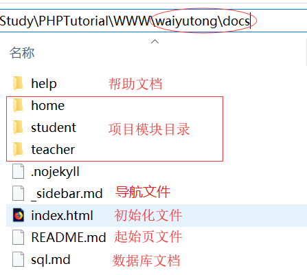
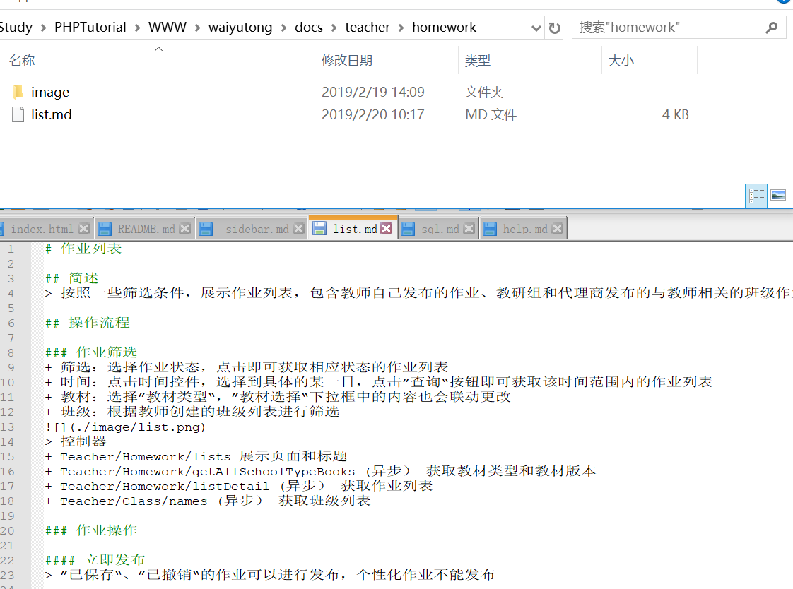
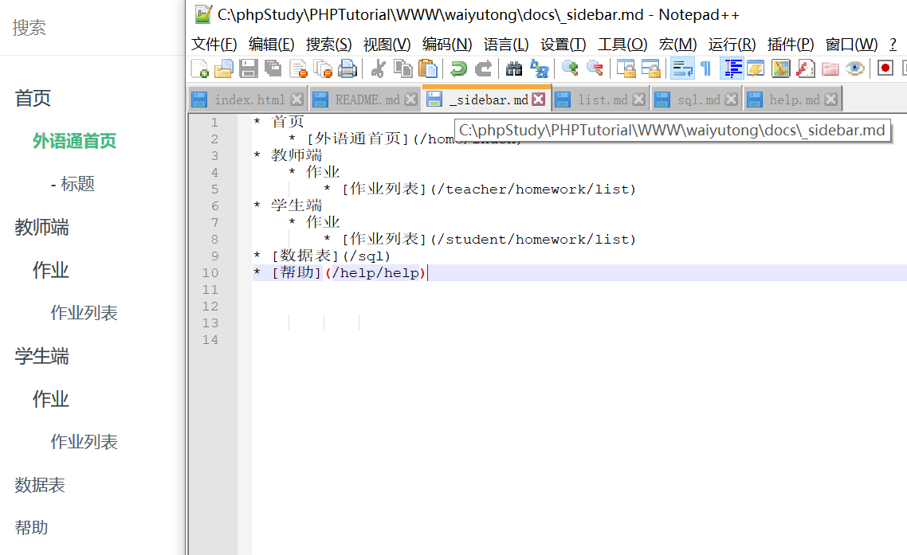
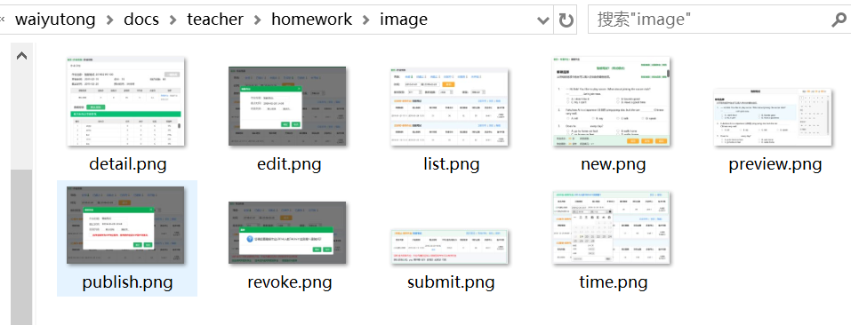

# 帮助

## 操作手册

### 目录结构
> 文档文件放在waiyutong/docs内，具体文件如图所示



### 编写文档
> 根据不同模块进入相应目录（还没有的目录自行创建），创建以“md”后缀的文件编写文档，文档遵循 [Markdown语法](/help/help?id=Markdown语法)，文档最下方标明作者，编写完毕后要 [更新导航栏](/help/help?id=更新导航栏)



### 更新导航栏
> 更新导航栏只需要修改文档根目录下的"_sidebar.md"文件，按照现有的格式添加新的超链接到指定的文件路径，导航栏文件同样遵循 [Markdown语法](/help/help?id=Markdown语法)



### 图片文件
> 在每个子模块下面创建”image“目录用于存放图片，以方便文档中引入和避免图片命名重复



### 更新文档
> 新建或修改文档后，本地访问无误后只需提交SVN即可

## Markdown语法
> Markdown是一种纯文本的标记语言，通过js可以转换成html语言

### 标题
> Markdown支持6种级别的标题，对应html标签 h1 ~ h6

示例：
```
# 这是一级标题
## 这是二级标题
### 这是三级标题
#### 这是四级标题
##### 这是五级标题
###### 这是六级标题
```
效果如下：
# 这是一级标题
## 这是二级标题
### 这是三级标题
#### 这是四级标题
##### 这是五级标题
###### 这是六级标题

### 引用
> 在引用的文字前加>即可。

示例：

` > 这是引用的内容 `

效果如下：
> 这是引用的内容

### 插入链接
> `[链接名称](链接地址)`

示例：

` [教师端作业列表](/teacher/homework/list) `

效果如下：
[教师端作业列表](/teacher/homework/list)

### 插入图片
> ``

示例：

`  `

效果如下：


### 列表
> 在文字前加*，文字与*之间要有空格

示例：
```
* 列表内容
* 列表内容
* 列表内容
```
效果如下：
* 列表内容
* 列表内容
* 列表内容

### 分割线
> 单独一行里输入 ---

示例：
`---`

效果如下：

---

### 表格
> 文字以 | 隔开，第二行分割表头和内容

示例：
```
表头|表头
--|--
内容|内容
内容|内容
```
效果如下：

表头|表头
--|--
内容|内容
内容|内容

### 代码块
> 单行代码：代码用一个反引号`包起来

``` 
`代码内容` 
```

> 多行代码：代码用三个反引号```包起来，且反引号单独占一行

```
代码内容
代码内容
代码内容
```

### 其他
> 如有其他疑问，可百度Markdown

---
作者：宫超群
