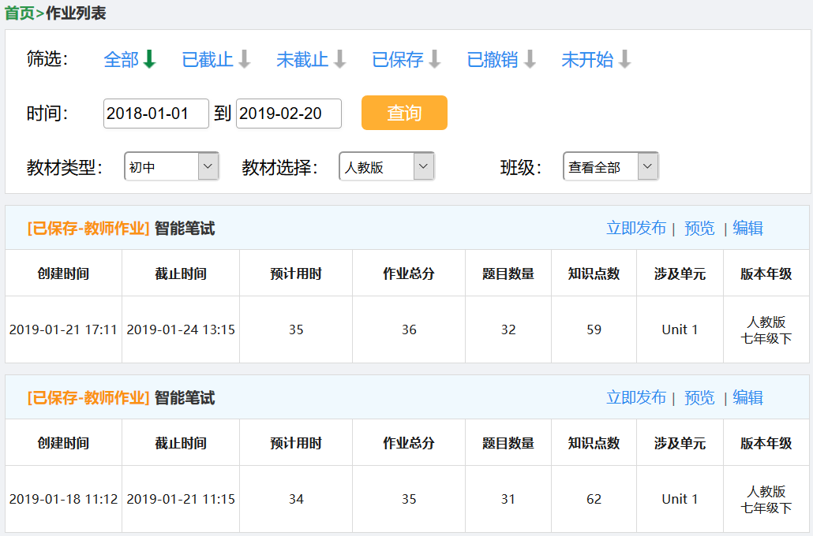
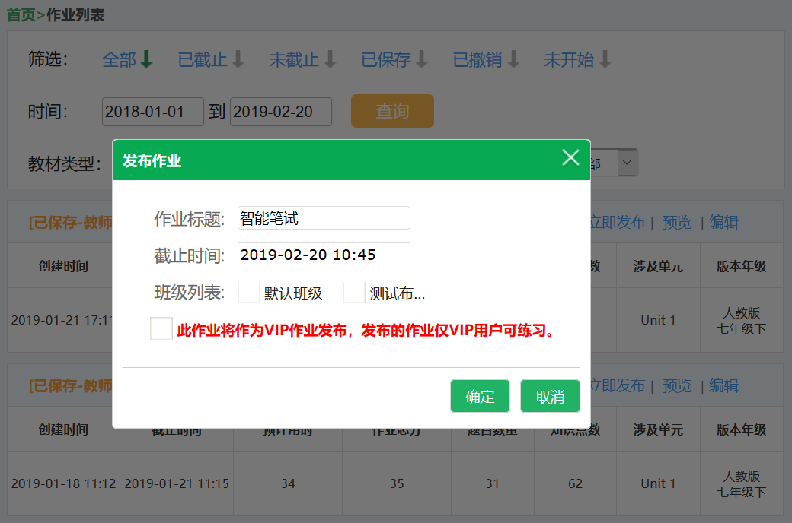
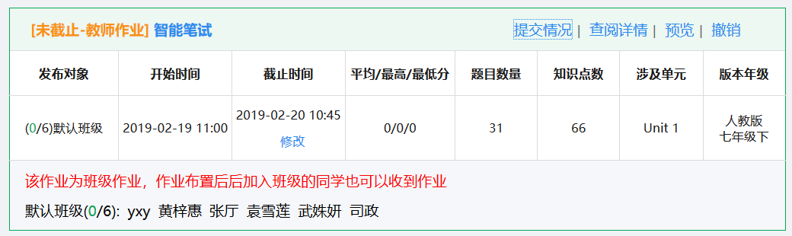
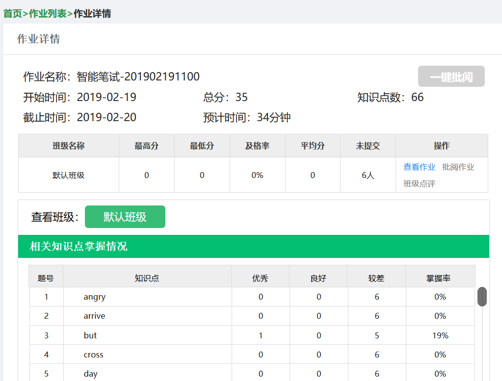
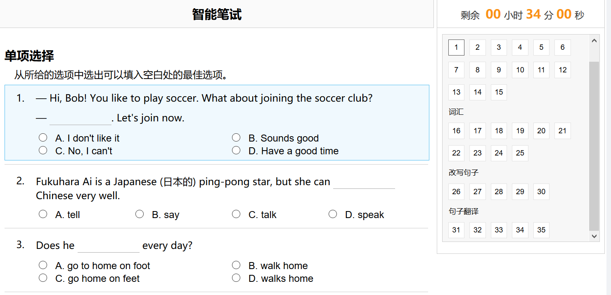
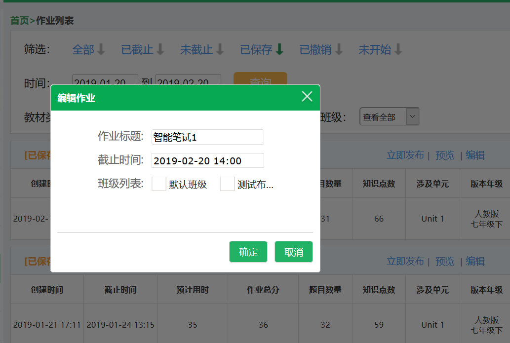
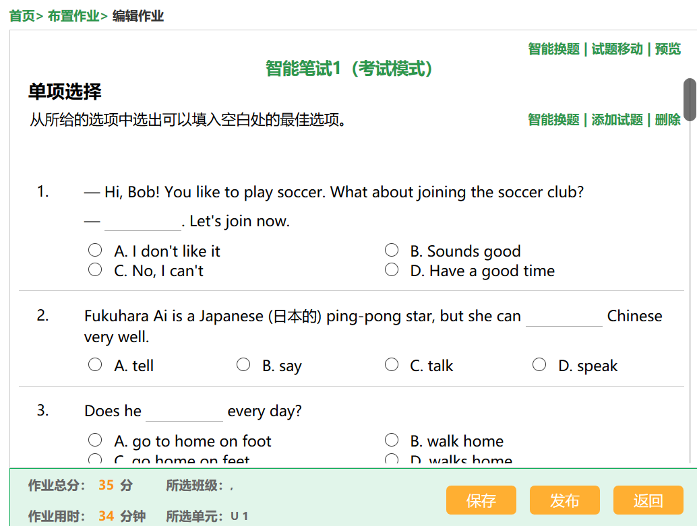
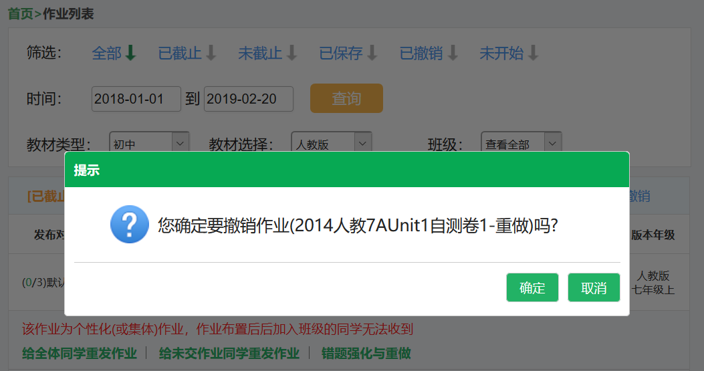
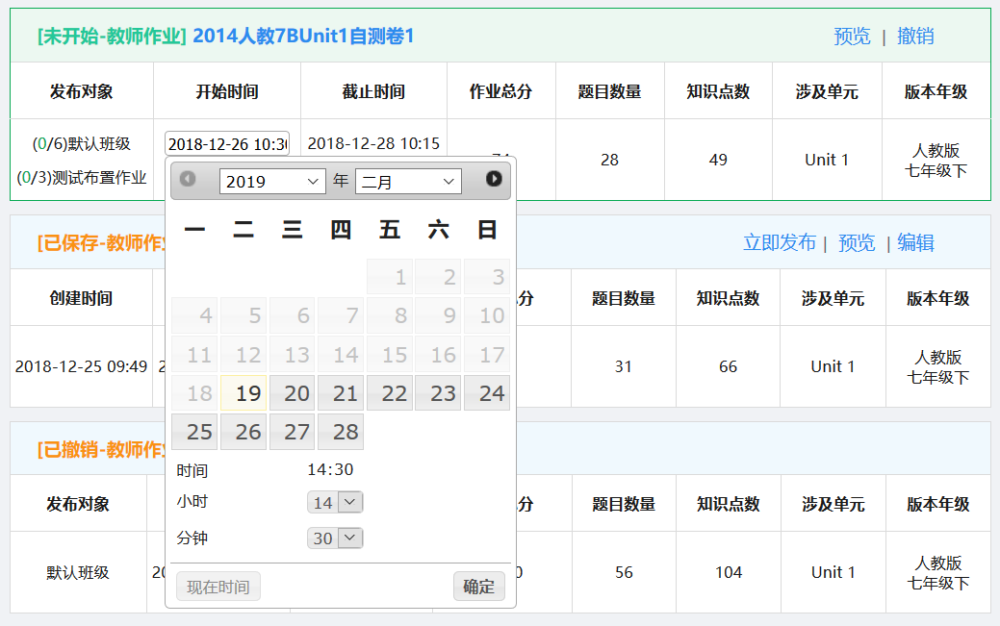

# 作业列表

## 简述
> 按照一些筛选条件，展示作业列表，包含教师自己发布的作业、教研组和代理商发布的与教师相关的班级作业

## 操作流程

### 作业筛选
+ 筛选：选择作业状态，点击即可获取相应状态的作业列表
+ 时间：点击时间控件，选择到具体的某一日，点击”查询“按钮即可获取该时间范围内的作业列表
+ 教材：选择”教材类型“，”教材选择“下拉框中的内容也会联动更改
+ 班级：根据教师创建的班级列表进行筛选

> 控制器
+ Teacher/Homework/lists 展示页面和标题
+ Teacher/Homework/getAllSchoolTypeBooks (异步） 获取教材类型和教材版本
+ Teacher/Homework/listDetail (异步） 获取作业列表
+ Teacher/Class/names (异步） 获取班级列表

### 作业操作

#### 立即发布
> ”已保存“、”已撤销“的作业可以进行发布，个性化作业不能发布

> 控制器

+ Teacher/Homework/publishHomeworkByHomeworkId 根据已有作业立即发布作业

#### 提交情况
> ”已截止“、”未截止“、”未开始“的作业可以查看提交情况

#### 查阅详情
> ”已截止“、”未截止“、”未开始“的作业可以查看作业详情

> 控制器

+ Teacher/Homework/detail 根据作业id获取作业详情

#### 预览
> ”已截止“、”未截止“、”未开始“、”已撤销“的作业可以预览，背单词、个性化作业不能预览

> 控制器

+ Home/Homework/preview 根据作业id进行预览
+ Common/Common/getTestByHomeworkId 获取班级作业或集体作业信息（异步）

#### 编辑
> ”已保存“、”已撤销“的班级作业可以进行编辑，自主纲要作业不能编辑

> 点击”确定“按钮跳转到编辑页面

> 控制器

+ Teacher/Homework/newHomework 显示布置作业页面
+ Teacher/Homework/edit 显示作业编辑内容（异步）
+ Common/Common/books 获取用户默认访问的教材列表（异步）

#### 撤销
> 教师自己布置的”未截止“、”已截止“、”未开始“的作业可以进行撤销

> 控制器

+ Teacher/Homework/revokeHomework 撤销作业（异步）

#### 修改开始时间、截止时间
> 教师自己布置的”未截止“、”已截止“的作业可以修改截止时间，”未开始“的作业可以修改开始时间和截止时间

> 控制器

+ Teacher/Homework/changeStarttime 修改作业开始时间（异步）
+ Teacher/Homework/changeEndtime 修改作业截止时间（异步）

## 注意
+ 按班级筛选时，需要过滤掉体验班级和没有学生的班级
+ 获取作业列表时需要过滤家长发布的作业
+ HomeworkService中getPage方法被重写，此处需要调用getSelfPage方法

## 数据表
+ [ts_group_homework_statistics](/sql?id=ts_group_homework_statistics)
+ [ts_homework](/sql?id=ts_homework)

---
作者：宫超群
